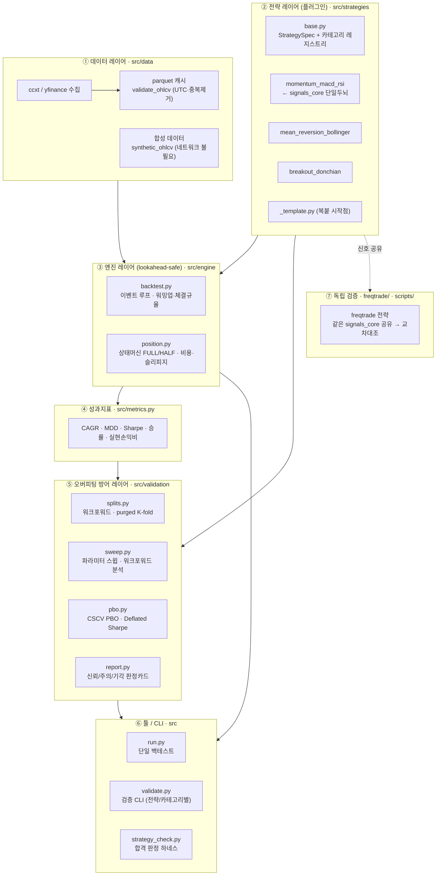
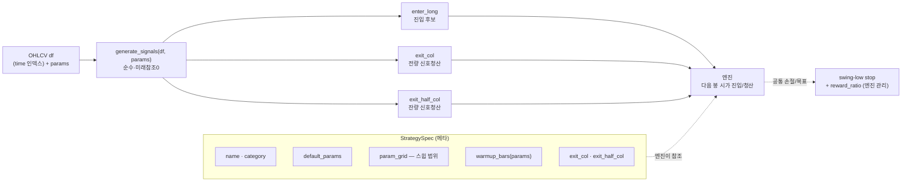
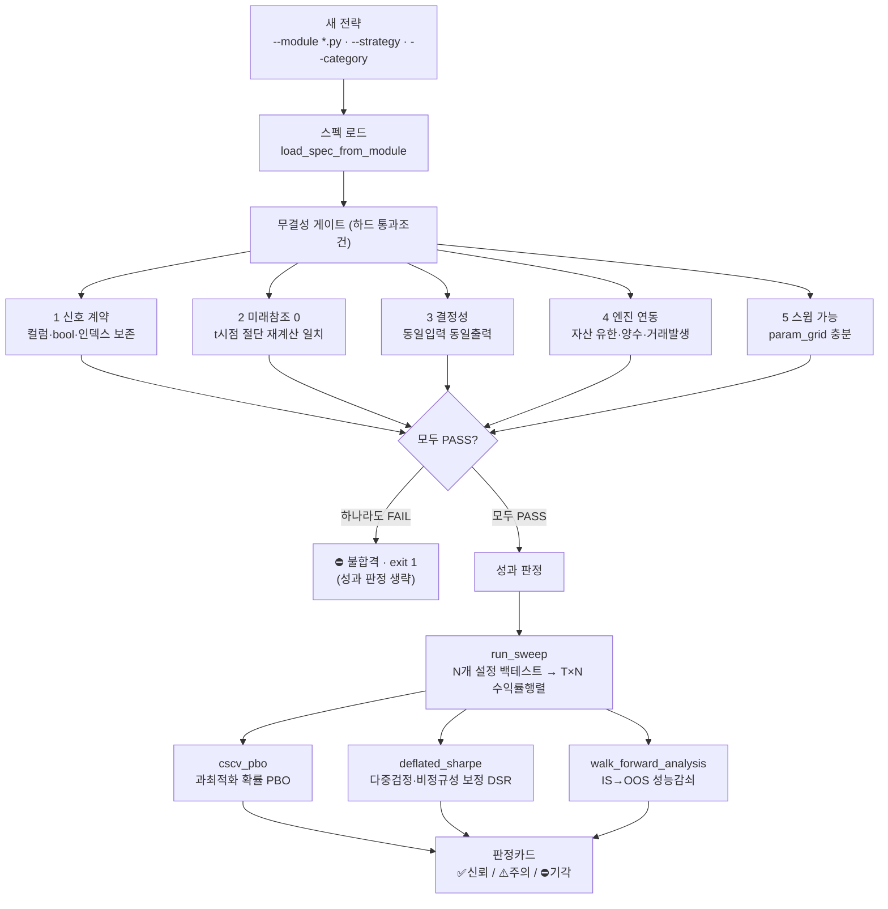
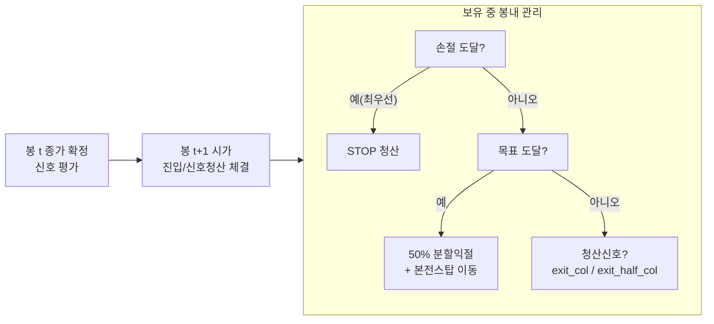

# 설계 구조도

퀀트 전략 실험 플랫폼의 아키텍처. 원칙은 하나: **두뇌(신호)·근육(엔진)·심판(검증)을
분리**해, 일반인은 얇은 툴 층만 만지고 기관급 엄밀성은 안쪽에 묻어둔다.

핵심 규율(전 레이어 공통): **미래참조 0**. 모든 신호는 t시점까지의 데이터만 쓰며,
진입/신호청산은 다음 봉 시가에 체결된다.

---

## 1. 레이어 구조 (전체 조감)

레이어 간 의존은 **한 방향**(위→아래로만 호출)이다. 전략은 엔진을 모르고, 엔진은
검증을 모른다. 검증·툴 층이 전략과 엔진을 조립해 돌린다.

---

## 2. 전략 플러그인 계약

모든 전략은 카테고리에 속하는 자족 모듈이며, 동일 계약을 따르므로 **무엇이든 같은
엔진·검증 레이어로 돌아간다**. 새 전략 = 모듈 1개 + `register()`.

손절/목표는 전략이 아니라 **엔진이 공통 관리**한다(전략은 진입·청산 신호에만 집중).

---

## 3. 합격 판정 하네스 파이프라인 (핵심 흐름)

새 전략을 가져오면(레지스트리 등록 무관, 임의 `.py` 포함) 한 번에 돌아가는 판정 흐름.

**무결성(규칙 위반 없음)** 과 **성과(돈이 되는가)** 를 분리한다. 무결성 통과 + 성과
기각이면 "정직하지만 안 좋은 전략"으로, 무결성 실패면 "신뢰 불가"로 판정된다.

---

## 4. 엔진 체결 규율 (무결성 §0)

- 신호는 종가 확정에서만, 체결은 다음 봉 시가 → **미래참조 방지**.
- 손절·목표 동시 도달 시 **손절 우선**(최악 가정).
- 수수료·슬리피지(·매도세) 반영. 분할익절 후 잔량은 본전스탑으로 보존.

---

## 5. 디렉터리 → 레이어 매핑

| 레이어 | 경로 | 역할 |
|---|---|---|
| ① 데이터 | `src/data/`, `synthetic_ohlcv` | 수집·캐시·정합성, 합성 폴백 |
| ② 전략 | `src/strategies/`, `src/signals_core.py` | 카테고리 플러그인 + 단일 두뇌 |
| ③ 엔진 | `src/engine/` | lookahead-safe 이벤트 백테스트 |
| ④ 지표 | `src/metrics.py` | 성과지표 산출 |
| ⑤ 검증 | `src/validation/` | 워크포워드·PBO·DSR·판정카드 |
| ⑥ 툴 | `src/run.py`, `src/validate.py`, `src/strategy_check.py` | 사용자 진입점 |
| ⑦ 독립검증 | `freqtrade/`, `scripts/` | 같은 신호 교차대조 |
| 테스트 | `tests/` | 미래참조·신호·엔진·검증·하네스 회귀 고정 |

---

## 6. 확장 지점 (설계상 열어둔 곳)

- **새 전략** → `src/strategies/`에 모듈 추가 + `register()`. 검증·툴은 자동 적용.
- **고속 스윕 백엔드(vectorbt 등)** → `src/validation/sweep.py`의 `_run_one` 한 함수만 교체.
- **일반인 UI(Streamlit 등)** → `validate.py`/`strategy_check.py`의 판정카드를 그대로 소비.
- **라이브 트레이딩** → 엔진과 같은 신호(`signals_core`/전략)를 freqtrade·nautilus로 연결.
